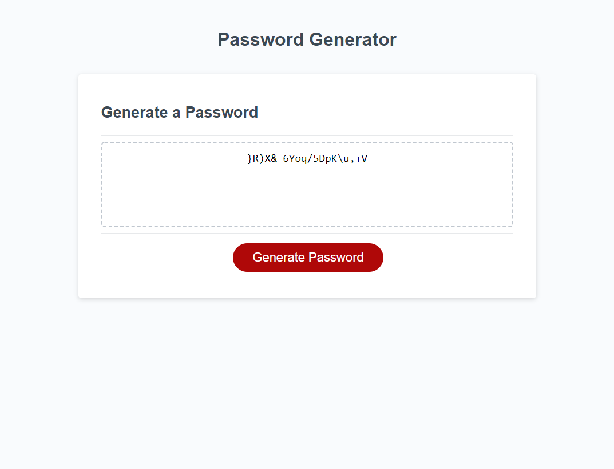
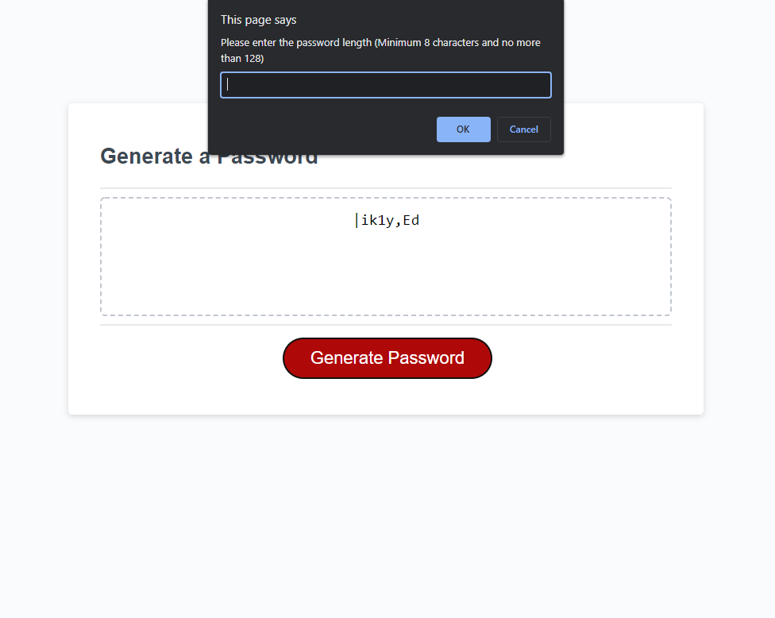

# Password Generator

## Goal
Design and develop a secure password generator with selectable criteria to create a strong password that provides greater security

## Website URL
https://daman29.github.io/Password-Generator/

Link above takes you to the webpage

## Description
```
- Designed and developed a secure password generator
- User is prompted to enter the length of the password between 8 and 128 characters inclusive
- The length is validated as a number if not then user gets prompted to try again
- User is prompted to select the password criteria to include lowercase, uppercase, numeric and/or special character
- Minimum one criteria is needed to be selected otherwise the user is re prompted
- After all prompts are answered a password is generated to matching criteria and displayed on the webpage
```

## Password Generator Overview
Below is the screen capture of the webpage.





---

## Bonus
- Added bonus security to include at least one character from each selected criteria and a random index is edited to include this character. But also it is rechecked to make sure the new password still has one character from each selected type until all criteria are met.